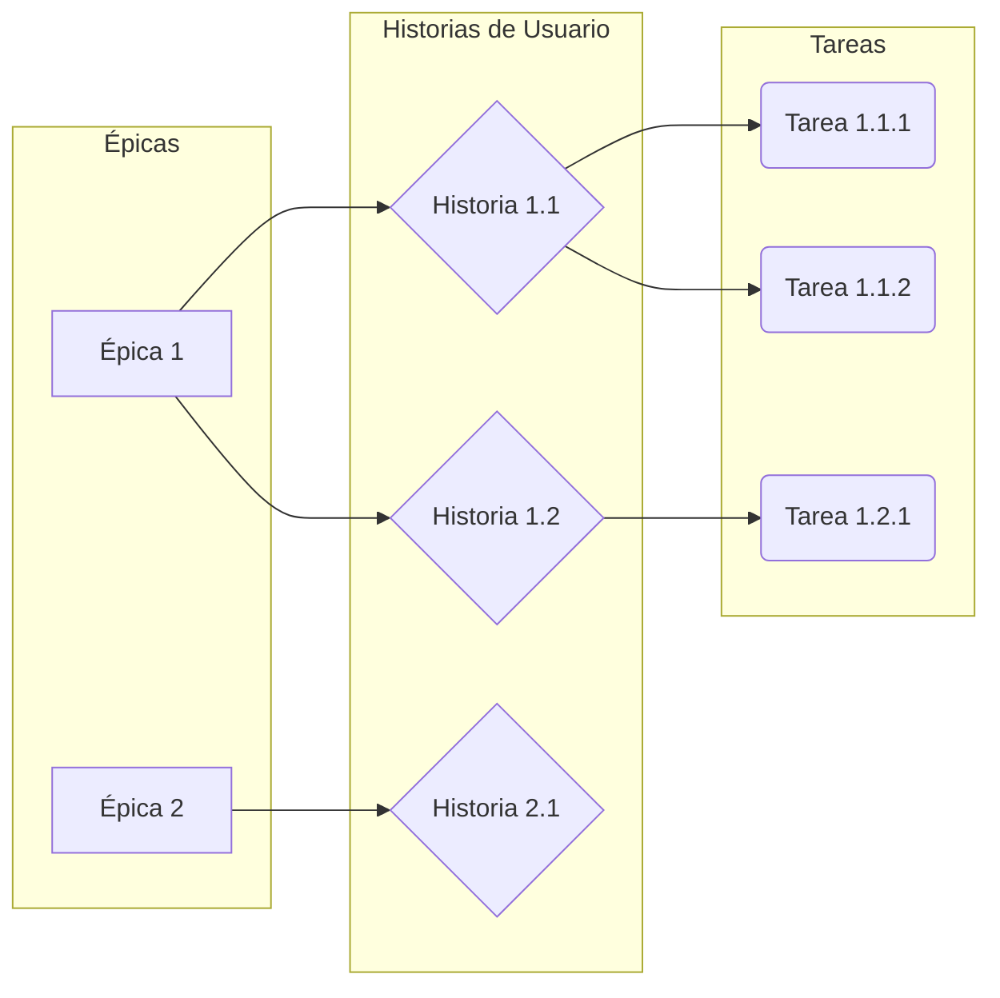
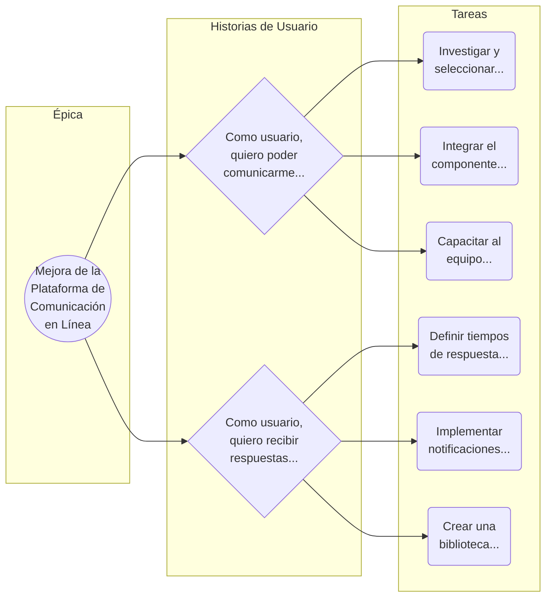

[[Componentes de la ingenieria de requerimientos]]

**Satisfacción de Usuarios y Objetivos de Negocio:** La ingeniería de requerimientos es un proceso vital en el desarrollo de software, que asegura que el producto final cumpla con las necesidades y expectativas de usuarios y partes interesadas, mientras se alinea con los objetivos del negocio.

**Especificación y Base para el Diseño:** Su enfoque radica en la definición del comportamiento, interacción y logro de objetivos del software, estableciendo así los cimientos esenciales para el proceso de diseño y desarrollo.

**Evitar Malentendidos y Fomentar la Comunicación Efectiva:** Al eliminar ambigüedades y facilitar la comunicación equipos, fomenta entre se una comprensión compartida y el uso de un lenguaje común, lo que contribuye a una colaboración efectiva.

**Reducción de Riesgos y Gestión de Cambios:** Al establecer objetivos clave desde el  principio, se minimizan los riesgos, y al mismo tiempo, se instituye un proceso para administrar cambios de manera efectiva, evitando potenciales problemas en el futuro

| Aspecto | Requerimientos de Usuario | Requerimientos de Sistema | Especificaciones de Diseño |
|---|---|---|---|
| Enfoque | Necesidades y expectativas de usuarios. | Operación, interacción y funcionamiento técnico. | Implementación de requerimientos en diseño técnico. |
| Contenido | Detalla funcionalidades y características. | Especifica operación, rendimiento y seguridad. | Describe arquitectura, componentes y detalles. |
| Audiencia | Usuarios y partes interesadas. | Equipos técnicos y desarrolladores. | Desarrolladores y expertos técnicos. |
| Cambios | Menos propensos a cambios. | Adaptación a evolución del sistema. | Ajustes en detalles de implementación. |
| Detalle | Detallados, menos técnicos. | Técnicos, considerando rendimiento y seguridad. | Altamente técnicos, instrucciones de construcción. |
| Relación | Base para requerimientos de Sistema. | Derivados de los Requerimientos de Usuario, guían diseño. | Transformación de requerimientos en instrucciones. |
## Requerimientos de Dominio
 Los requerimientos de dominio son un tipo de requerimientos en el desarrollo de software que se centran en aspectos específicos del entorno, la industria o el contexto en el que se desplegará el sistema. Estos requerimientos se derivan de Ia comprensión profunda del dominio en el que operará el software y tienen como objetivo garantizar que el sistema sea adecuado y cumpla con las regulaciones, prácticas y necesidades únicas del entorno en cuestión.

![[Pasted image 20240930101019.png]]

### Tipos de Requerimientos de Dominio
 
 **Culturales y Lingüísticos:** Para software en varias regiones o culturas, pueden haber necesidades de localización, traducción y adaptación cultural.
 
**De Rendimiento:** Algunos dominios requieren rendimiento específico, como aplicaciones en tiempo real o alta disponibilidad.

**De Integración:** Si el software se conecta con otros sistemas en el dominio, puede surgir requerimientos de integración específicos.

**De Usabilidad:** Si el software se enfoca en un grupo demográfico, pueden surgir necesidades específicas de usabilidad para ese grupo.

**De Adaptación:** En entornos cambiantes, como la industria financiera, pueden haber requerimientos para que el software se adapte a cambios regulatorios o de mercado.

## Requerimientos Funcionales

Los requerimientos funcionales son vitales en el desarrollo de software, ya que
describen las acciones y capacidades específicas que un sistema o software debe
lograr.

Al detallar operaciones, tareas comportamientos concretos, enriquecen la comprensión
completa las de funcionalidades del sistema y proporcionan una guía clara para el diseño y desarrollo efectivo.

### Tipos de requerimientos Funcionales

**De Entrada:** Estos requerimientos se centran en las entradas que el sistema debe aceptar, como datos ingresados por el usuario u otras fuentes. 

**De Proceso:** Describen las operaciones internas y procesos que el sistema debe
llevar a cabo para procesar los datos y generar resultados.

**De Salida:** Se refieren a las salidas o resultados que el sistema debe generar e
respuesta a las entradas y procesos realizados.

**De Interfaz de Usuario:** Describen cómo los usuarios interactuarán con la interfaz
del software, incluyendo elementos de diseño y navegación.

**De Almacenamiento:** Definen cómo el software debe gestionar y almacenar los
datos de manera segura y eficiente.

**De Comunicación:** Se refieren a la forma en que el sistema debe comunicarse con
otros sistemas o componentes, ya sea interna o externamente.

**De Validación y Verificación:** Establecen cómo el sistema debe validar y verificar la
exactitud y la integridad de los datos y las operaciones.

**De Flujo de Trabajo:** Describen las secuencias de acciones que el sistema deb
seguir para completar ciertos procesos o tareas.

**De Seguridad:** Definen cómo el sistema debe gestionar la seguridad de los da s y
las funciones, incluyendo autenticación y autorización.

**De Integración:** Especifican cómo el software debe integrarse con otros si emas o
servicios externos.

## Requerimientos No-Funcionales

Los requerimientos no funcionales son una categoría de requerimientos en el desarrollo
de software que se enfoca en atributos y características las distintos de funcionalidades específicas del sistema.

Definen cómo el software debe comportarse en términos de características más amplias y cómo debe satisfacer necesidades y expectativas más allá de las funcionalidades básicas. 

## Tipos de requerimientos No-Funcionales

**Mantenibilidad:** Relacionado con la facilidad para realizar cambios, actualizaciones y correcciones en el sistema a lo largo del tiempo.

**Compatibilidad:** Asegura que el sistema funcione correctamente en diferentes entornos, dispositivos y plataformas.

**Cumplimiento Legal y Normativo:** Se refiere a la adhesión a regulaciones, estándares de la industria y requisitos legales.

**Eficiencia de Recursos:** Enfocado en el uso eficiente de recursos como CPU,
memoria y ancho de banda para optimizar el rendimiento y la sostenibilidad.

![[Pasted image 20240930103501.png]]

## Requerimientos de integración

Dentro de los requerimientos no-funcionales, se incluyen los de integración de sistemas. En cursos posteriores, se explorarán diferentes modalidades de integración. En este curso se introducirá los requerimientos de integración a nivel de aplicación, con el propósito de facilitar la colaboración equipos.

Los requerimientos de integración se encargan de establecer objetivos y criterios generales para la integración. Para completar estos requerimientos, entran en juego las especificaciones técnicas de integración. Estas especificaciones ofrecen los detalles 
necesarios para orientar la ejecución práctica del proceso.

### Beneficios de las Especificaciones de Integración

**Claridad y Comprensión Común:** Establecen una visión compartida sobre cómo se
logrará la integración.

**Reducción de Malentendidos:** Minimizan la posibilidad de confusiones al detallar
los aspectos técnicos.

**Roles y Responsabilidades Claros:** Definen quién hace qué en el proceso de
integración.

**Facilitación de la Colaboración:** Ayudan a diferentes equipos a trabajar juntos d
manera coherente.

**Referencia Documentada:** Sirven como recurso para cualquier miembro de
equipo.

**Resolución de Desacuerdos:** Proporcionan una base objetiva para tomar
decisiones en caso de desacuerdos.

**Planificación Efectiva:** Informan sobre los aspectos técnicos para una planificación
precisa.

**Eficiencia en las Pruebas:** Base para casos de prueba de integración que mejoran
la eficacia en las pruebas.

**Minimización de Riesgos:** Reducen los riesgos de errores y retrasos al proporcionar
orientación detallada.

# Especificaciones de Integración para el trabajo en equipo

En los cursos venideros, se abordarán diversas modalidades de integración. En esta introducción, se pondrá énfasis en las técnicas de integración para fomentar la colaboración entre equipos de desarrollo y eliminar interdependencias. 

Especificar las integraciones de software entre equipos es esencial para lograr
colaboración fluida, coherencia técnica y éxito en el proyecto. Asegura un funcionamiento efectivo y armonioso de todos los componentes.

### Técnicas básicas para la colaboración entre sistemas y equipos

**Separación de Dependencias:** Al aplicar esta estrategia, reduces las interdependencias entre los componentes, posibilitando el uso de implementaciones simuladas para aislar módulos del sistema. Esto permite un control más preciso, disminuye efectos secundarios y potencia la flexibilidad y el desarrollo en paralelo. 

Los "Fakes", "Stubs" y pueden ser utilizados en el desarrollo para simular interacciones con
componentes reales y lograr un aislamiento efectivo entre ellos.

**Fakes (Inplementaciones Falsas)**: Son versiones simplificadas de componentes
reales empleadas para aislar una unidad de código de sus dependencias reales. Pueden
memoria, servicios simples u otras implementaciones que imitan comportamiento esencial de los componentes reales.

![[Pasted image 20240930105525.png]]

**Mocks:** Son representaciones simuladas de componentes reales que se emplean para simular interacciones y comportamientos dinámicos.

Los mocks se configuran para responder de manera específica a ciertas interacciones, lo  que posibilita el control y la evaluación de cómo responde la unidad bajo escenarios concretos.

**Stubs:** Son implementaciones estáticas de componentes o funciones utilizados para ofrecer predefinidas. respuestas diferencia de los mocks, los stubs no simulan comportamientos dinámicos; en cambio, proporcionan respuestas estáticas a las llamadas de funciones o métodos.

## Análisis de requerimientos en el "SDLC"

El análisis de requerimientos es una etapa fundamental dentro del Ciclo de Vida del
Desarrollo de Software.

Este análisis no se limita a una fase inicial, sino que se extiende a lo largo de todo el
ciclo, permitiendo una adaptación constante y una respuesta ágil a los cambios y desafíos
que puedan surgir.

###  Requerimientos en las etapas del SDLC
 
 **Fase de Planificación:** En esta etapa inicial, se identifican las necesidades y oportunidades para el desarrollo del software. Se realiza un análisis preliminar de los requerimientos para determinar si el proyecto es factible y viable desde el punto de vista técnico, financiero y temporal.

**Fase de Análisis:** Aquí, se realiza un examen detallado de las necesidades y expectativas de los usuarios y las partes interesadas. Se recopilan, documentan y desglosan los requerimientos funcionales y no funcionales del sistema.

**Fase de Diseño:** Una vez que los requerimientos están claros, se utiliza la información del análisis para diseñar la arquitectura general del sistema.  Los requerimientos de diseño, como la estructura de los módulos y la interfaz de usuario, se basan en los requerimientos analizados.

**Fase de Implententación:** Los equipos de desarrollo utilizan los requerimientos como base
para codificar y construir el software. Los requerimientos funcionales guían la implementación de las funcionalidades y las acciones específicas que el sistema debe realizar.

**Fase de Pruebas:** Se verifica que el software cumplacon los requerimientos establecidos. Se desarrollan casos de prueba basados en los requerimientos funcionales y no funcionales para asegurarse de que el sistema funcione correctamente. 

**Fase de entrega Despligue:** el software es entregado a los usurios Ina es asan ose en los
reauerimientos acordados. Los usuarios evaluan si el software satisface sus necesidades y si los requerimientos se han cumplido adecuadamente.

Fase de Mantenimiento: A lo largo del ciclo de vida
del software, los requerimientos pueden cambiar
debido a actualizaciones, me 'oras o cambios en las
necesidades e los usuarios. fase de mantenimiento
utiliza el an lisis de reauerimientos para evaluar y
realizar cambios en el software.

## Niveles de trabajo en el desarrollo de software ágil

Al elegir enfoques ágiles de desarrollo, como Scrum, Kanban o XP, se emplean niveles de
trabajo variados para descomponer tareas complejas, en componentes más manejables,(Epics), Características como Epicas (Features), Historias de Usuario (User Stories) y Tareas (Tasks).

Este enfoque simplifica la planificación, priorización y seguimiento del progreso, garantizando un enfoque centrado en el usuario, fomentando la colaboración del
equipo y posibilitando una adaptación efectiva ante los cambios.

![[Pasted image 20240930110545.png]]

### Épicas (Epics)

Las Épicas, también conocidas como "Epics" en inglés, son unidades de trabajo de alto nivel
funcionalidades que representan características amplias y significativas dentro de un proyecto.

Son objetivos o requisitos de gran alcance que generalmente no pueden implementarse en una única iteración o sprint. Las épicas ayudan a proporcionar una visión general y estratégica de lo que se planea lograr en el proyecto y luego se dividen en características
manejables.

### Caractensticas

Una Característica, también conocida como "Feature" en inglés, es una funcionalidad
específica y distintiva que un producto o sistema ofrece para cumplir con las  necesidades o requisitos del usuario.

Estas características son unidades de trabajo más manejables y se implementan para agregar valor al producto final.

### Historias de Usuario
Las Historias de Usuario, también conocidas como "User Stories" en inglés, son breves descripciones de funcionalidades desde la perspectiva del usuario final. A diferencia de los "features", las historias de usuario se centran en las necesidades del usuario, expresando qué acciones busca realizar y por qué. Mientras tanto, los "features" son las partes específicas del software diseñadas para satisfacer esas necesidades y cumplir los objetivos
planteados.

### Tareas

![[Pasted image 20240930111040.png]]

## Los Casos de Uso

Los casos de uso en el análisis de requerimientos de software son una técnica utilizada para describir cómo interactúan los actores (usuarios o sistemas externos) con un sistema a través de escenarios específicos. Un caso de uso representa una interacción específica entre un actor y el sistema, y describe el flujo de eventos que ocurren cuando se realiza es
interacción.

Los casos de uso ayudan a capturar los requisitos funcionales del sistema desde la perspectiva del usuario y proporcionan una forma clara y comprensible de documentar los escenarios de uso.

### Contenido de un Caso De Uso

En lugar de describir directamente los casos de uso, resulta más sencillo comenzar describiendo escenarios. Un escenario es una secuencia de pasos que describe una interacción entre un usuario y un sistema.

> [!Exaple]
> Por ejemplo, en el caso de una tienda en línea basada en la web, podríamos tener un
escenario llamado "Comprar un producto"

Escenario: Comprar un Producto Descripción: "El cliente explora el catálogo, agrega elementos al carrito y al confirmar la compra con envío e información de tarjeta de crédito, el sistema verifica la autorización y envía confirmación y seguimiento por correo."

Este escenario representa una acción que puede ocurrir. Sin embargo, la autorización de la tarjeta de crédito podría fallar, lo que sería otro escenario.
En otro caso, podríamos tener un cliente habitual para el cual no es necesario capturar la información de envío y tarjeta de crédito lo que sería un tercer escenario.

### Beneficios del análisis de los Casos de Uso

**Requerimientos Funcionales:** Los casos de uso identifican interacciones actores-sistema, detallando funcionalidades y su comportamiento en distintas situaciones.

**Comunicación Efectiva:** Los casos de uso ofrecen una comunicación clara de los requerimientos del sistema a los equipos de desarrollo, "Stakeholders" y usuarios finales.

**Validación de Requisitos:** Validan requisitos con "Stakeholders" al mostrar interacciones sistema-usuario, identificando discrepancias y aclarando expectativas.

**Diseño Guiado por el Usuario:** Los casos de uso mejoran usabilidad y experiencia al
diseñar sistema desde perspectiva del usuario.

### La relación de los Casos de uso con los Niveles de trabajo

Los casos de uso pueden dividirse en tareas más pequeñas y manejable; como parte del
proceso de implementación.

Cada tarea representa una acción específica que debe realizarse para que el caso de uso
se complete exitosamente. 

Las tareas se derivan de los pasos detallados descritos en los casos de uso y pueden
asignarse a miembros del equipo para su ejecución.

### Diagramas de Casos de Uso

Los diagramas de casos de uso son una herramienta gráfica utilizada en el análisis y
diseño de software para representar visualmente las interacciones entre los actores usuarios o sistemas externos) y los casos de uso en un sistema.

Estos diagramas son una parte fundamental de la metodología UML (Lenguaje de
Modelado Unificado) y son útiles para capturar y comunicar la funcionalidad del
sistema de una manera comprensible.

### Estimación de requerimientos a Alto Nivel